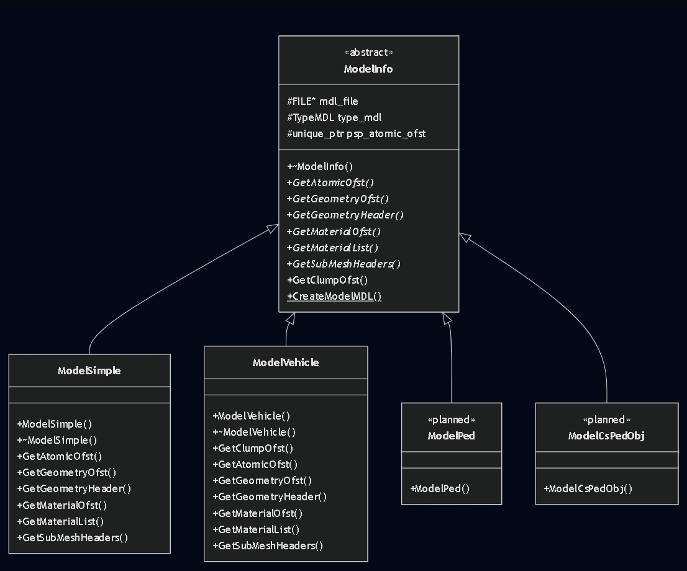
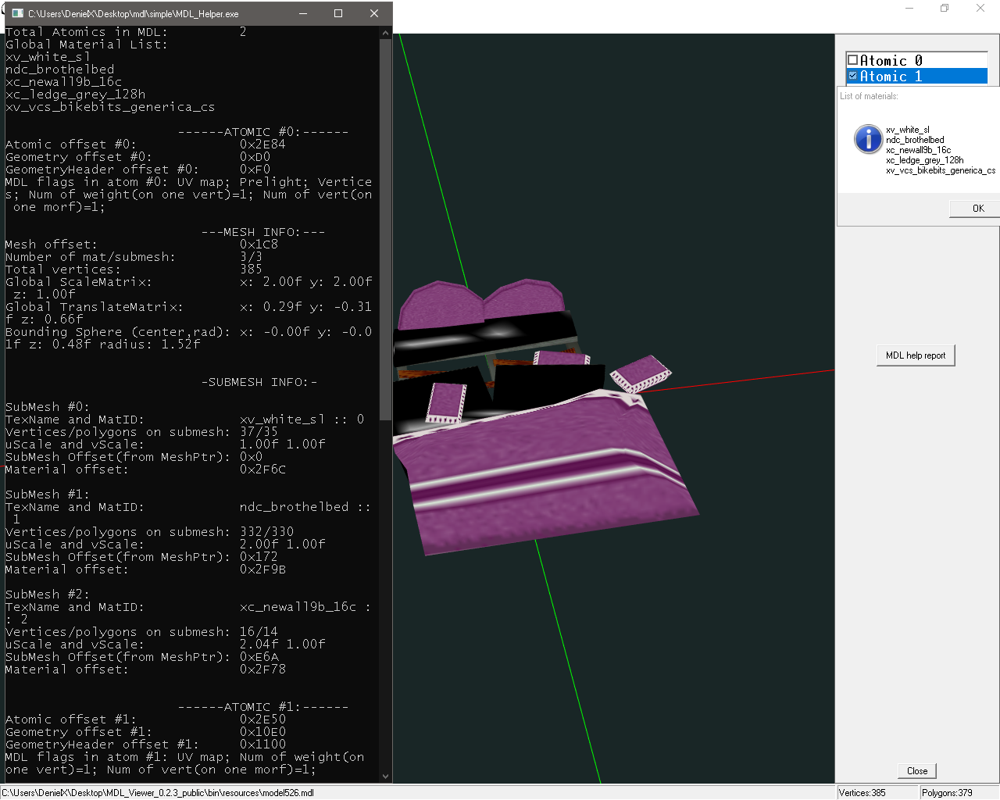

# MDL Helper
<p align="center">
  
</p>
<p align="center">
  
</p>

*Инструмент для частичного моддинга и анализа 3D-моделей формата `.mdl` (движок Leeds от "Великого Автоугонщика": VCS).*

**Автор:** DenielX

**Contributing:** DMCA-risks, closed.

## 🛠 Requirements & Build Instructions (Сборка проекта)
Проект использует **CMake** для универсальной генерации файлов под любую современную среду разработки. Поддерживаются конфигурации x86 и x64 (Debug / Release).

1. Установите [CMake](https://cmake.org/).
2. Откройте терминал в корневой папке проекта и создайте директорию для сборки:
   ```bash
   mkdir build
   cd build

Сгенерируйте проект под вашу IDE:

Для Visual Studio (MSVC): cmake .. (откройте сгенерированный .sln файл).

Для Code::Blocks (MinGW): cmake -G "CodeBlocks - MinGW Makefiles" ..

Для сборки Release версии (в консоли): cmake --build . --config Release

🚀 Usage (Использование)
Утилита максимально проста в использовании:

Вы можете просто перетащить нужный .mdl файл прямо на скомпилированный .exe (Drag-and-Drop).

Если запустить программу без аргументов, она попытается найти и проанализировать файл model.mdl в своей директории по умолчанию.

🙏 Special Thanks (Благодарности)
Особая благодарность следующим людям и ресурсам за помощь в R&D, тестирование и предоставленные материалы, без которых этот проект был бы невозможен:

[@aap / TheHero](https://github.com/aap). — за основной вклад в разбор форматов LC/VC Stories.

[@spicybung](https://github.com/spicybung). — за разбор и предоставленные логи ещё не реализованных типов моделей. За совместное R&D.

[@Majestic](https://github.com/majesticR3). — за предоставленные инструменты по анализу форматов (Stories Map Converter), которые сильно упростили разбор структур MDL.

**gtamodding.ru wiki и gtamods.com** — за энциклопедирование и документацию форматов (отдельное спасибо всем участникам статьи MDL, подхватившим мой старт).

📄 License
Данный проект распространяется под лицензией MIT License. Вы можете свободно использовать, изменять и распространять этот код (в том числе в коммерческих модификациях) при условии обязательного указания авторства. Программа предоставляется "как есть", без каких-либо гарантий.

Acknowledgements & Third-Party Code
AI Assistance: The core architecture and logic remain human-directed. Some parts of the codebase (refactoring and markdown documentation) were generated/refined with the help of LLM (Gemini).